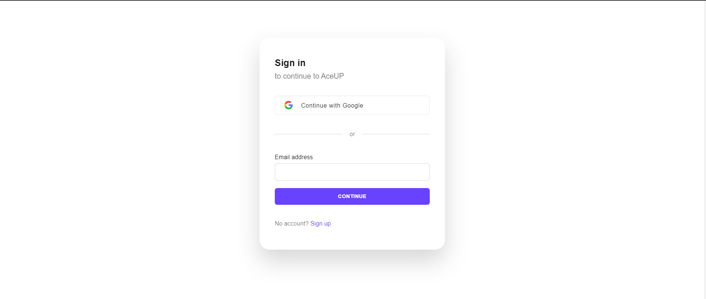
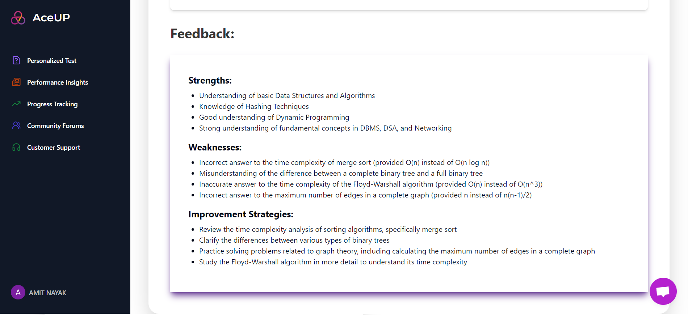
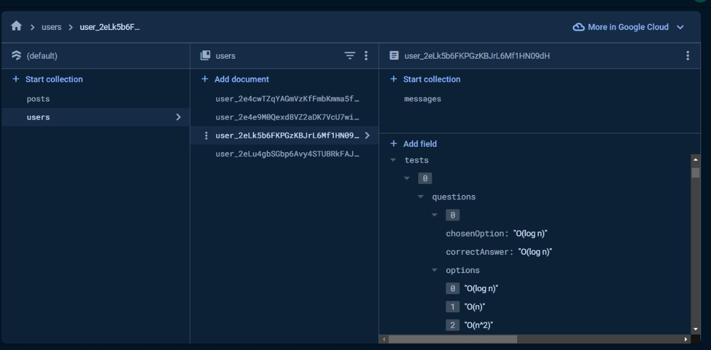

# AceUP - Adaptive Quiz Learning Platform


## Overview

AceUP is an innovative adaptive quiz learning platform designed to analyze student performance and provide personalized insights and improvement strategies. Our platform focuses on enhancing the learning experience for students in subjects like DBMS, DSA, and Networking.


## Features

- **Adaptive Quizzes:** Tailored quizzes based on individual student progress and knowledge levels.
- **Detailed Insights:** Comprehensive performance analysis with constructive feedback.
- **Community Forums:** Collaborative space for students and educators to engage in discussions and share insights.
- **User-Friendly Interface:** Intuitive design for seamless navigation and engagement.

## Tech Stack

- **Front-end:** Next.js, React, Tailwind CSS, TypeScript
- **Back-end:** Firebase, LangChain, Gemini API, Clerk
- **Database:** MongoDB
- **Other Tools:** GraphQL, Crisp SDK

## Project Pages

### ⭐ Landing Page
The main entry point for users, providing an overview of the platform's features and benefits.


### 🔑 Authentication Pages
Pages for user authentication including login, registration, and profile management.



### 📊 Main Dashboard
Dashboard explaining various features of the application.


### 📋 Diagnostics Test Page
An initial test to assess the student's current level and performance to help them improve further.


### 📝 Main Test Page
The main interface where students take adaptive quizzes in subjects like DBMS, DSA, and Networking. This page features a user-friendly layout designed to engage students and facilitate effective learning through interactive quizzes tailored to individual progress and knowledge levels.


### 📈 Assessments and Insights
A comprehensive page that provides students with a detailed evaluation of their quiz performance and personalized insights for improvement. This page includes a thorough breakdown of their answers, highlighting correct and incorrect responses, and offers constructive feedback.



### 💬 Community Forums
The Community Forums provide a collaborative space for students and educators to engage in discussions, share insights, and seek advice related to their learning journey. It fosters a supportive environment where participants can ask questions, exchange knowledge, and explore diverse perspectives on topics covered in the curriculum. This platform encourages active participation, networking, and community building among users, enhancing the overall learning experience.


### 🔧 Backend
Screenshots showcasing the backend infrastructure.



### Key Highlights
- Developed an adaptive quiz learning platform to analyze and enhance student performance.
- Created a detailed insights page for personalized feedback.
- Integrated Crisp SDK for customer support.
- Leveraged Next.js and React with Tailwind CSS for an engaging front-end experience.
- Utilized Next.js Server Actions, Firebase, Recoil, and Clerk for backend services.
- Integrated the project with Gemini API using LangChain.

## Installation

1. Clone the repository
   ```bash
   git clone https://github.com/yourusername/aceup-project.git
   cd aceup-project
   ```

2. Install dependencies
   ```bash
   npm install
   ```

3. Set up the .env similar to envexample file


4. Run the development server
   ```bash
   npm run dev
   ```

5. Open http://localhost:3000 in your browser.


## Contribution

1. Fork the repository.
2. Create a new branch (git checkout -b feature/your-feature-name).
3. Make your changes and commit them (git commit -m 'Add some feature').
4. Push to the branch (git push origin feature/your-feature-name).
5. Create a new Pull Request.

